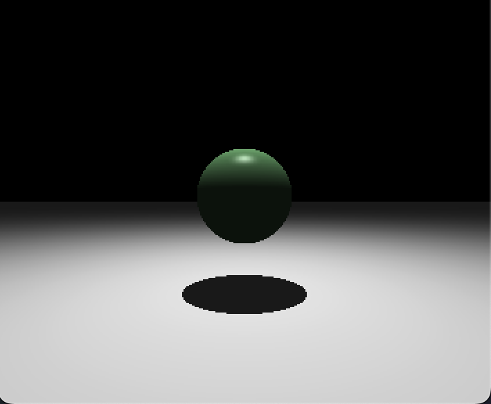
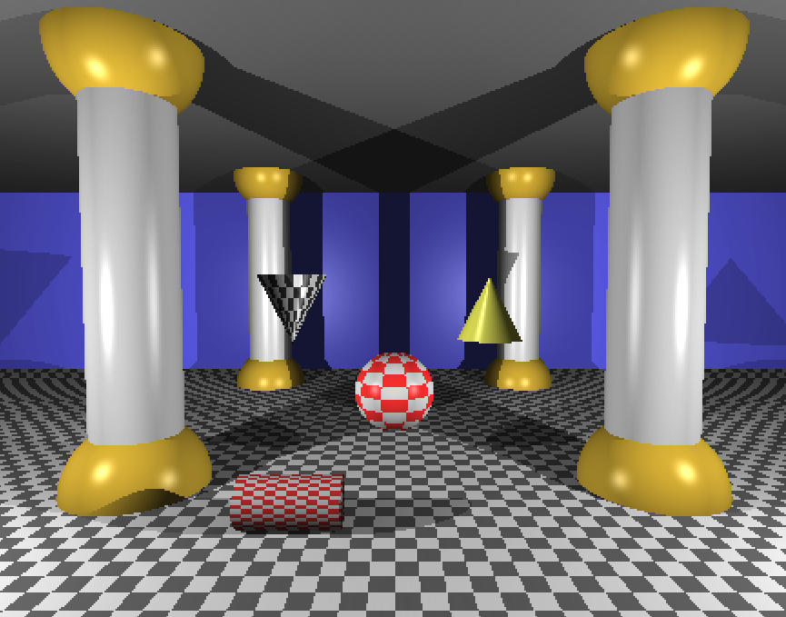
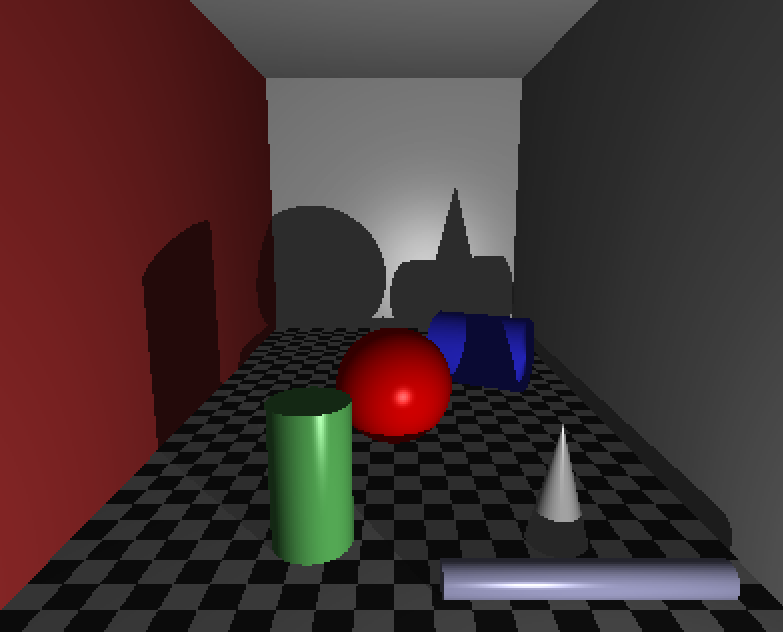

## miniRT


- A raytracer written from scratch with C. Uses the MLX42 graphical library.

### Features:
- Uses my custom [memory arena](https://www.github.com/juusokasperi/memarena) for all memory operations.
- Utilizes multithreading and a thread-pool system for efficient performance.
- Anti-aliasing.
- Bounding Volume Hierarchy implementation for efficiency.
- Supports planes, cylinders, cones and spheres.
- Diffuse and specular shading and falloff. 
- Supports multiple coloured lights. Has a checkerboard pattern implementation.

### Movement in scenes:
```
Move:
  W: Forward
  S: Backward
  A: Left
  D: Right
  Q: Up
  E: Down
Rotate:
  Up Arrow: Look up
  Down Arrow: Look down
  Left Arrow: Turn left
  Right Arrow: Turn right
Other:
  ESC: Quit
```

### Setting up scenes:

- Each scene can have a maximum of 1 ambient light and a maximum of 1 cameras. The scenes can have any number of lights and objects.
- An object can be set to be checkerboarded with adding the `:ck` and `:scale (0-20)` to it (e.g. `cy:ck:5`)
- A light ratio must be between 0.0 - 1.0.
- Direction vectors need to be between -1, 1 and cannot be (0, 0, 0).
- RGB values must be between 0 - 255.
- Camera FOV must be between 0-180.

```
# Ambient light
	ratio (0-1)		rgb
A	0			255,255,255

# Camera
	position	direction (-1,1)		fov(0-180)
C	0,0,0		0,0,1	 			50

# Lights (any amount)
	position	ratio (0-1)	rgb
L	0,0,0		1		255,255,255

# Cylinder
	center	direction	diameter	height		rgb
cy	0,0,0	1,0,0		10		10		200,200,200

# Sphere
	center		diameter		rgb
sp	0,0,0		16			195,160,50

# Plane
	point	direction	rgb
pl	0,0,0	0,1,0		225,225,225

# Cone
	center	direction	diameter	height	rgb
co	0,0,0	0,1,0 		10		10	255,255,100

# Checkerboard pattern (works for every object)
pl:ck:0.5 0,0,0 0,1,0 225,225,225/100,100,100
```

### Example scenes:





